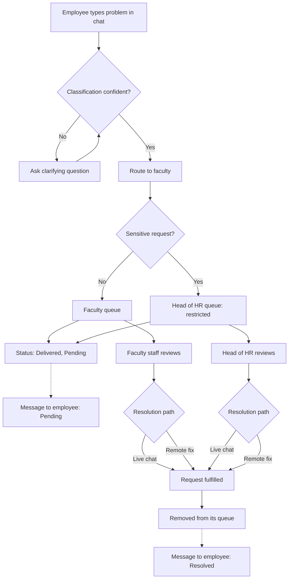

# Architecture: Internal Issue Routing Assistant

This is an **architecture draft, not implementation**. It reasons about
structure, responsibility, and trust boundaries based on
`product-spec.md`. No code, no database schema, no API design, no AI
implementation details, and no microservices decisions are made here.

## Not Yet (out of scope for this file)

- No code — frontend or backend
- No database tables/collections/indexes
- No detailed endpoint schemas, no CI/CD, no production infrastructure
- No AI feature implementation details
- No unnecessary microservices — the system is treated as simply as possible
  until a specific requirement forces a split

---

## Purpose + Scope

**Requirements driving this design** (from `product-spec.md`):
- FR1–FR6: employee submits free text → system classifies → routes to a
  faculty/department → confirms/corrects routing, asking a clarifying
  question first if classification isn't confident
- FR7–FR9: department queue view, history of past requests
- FR10–FR12: every request must have a clear owner, a visible status, and
  (when applicable) a visible approval state
- NFR: sensitive requests must be kept private — restricted specifically
  to the Head of HR, never visible to general faculty staff
- Constraint: this is a **standalone application** — not embedded in an
  existing chat tool or intranet

**Actors:**
- Employee (submits requests, receives status messages)
- Faculty Staff (reviews and resolves requests in their own queue)
- Head of HR (the only person who can see and resolve requests flagged
  sensitive)
- Department Admin (configures what routes to their department/faculty)
- System Administrator (configures faculties/routing rules globally)

**System boundary:** Everything an employee, faculty staff member, or the
Head of HR does — submitting, routing, checking sensitivity, tracking,
resolving — happens inside this one application. The only thing that may
sit outside the boundary is **identity/login**, if the company already
has an existing identity system — that is a boundary decision, not an
integration of the request-handling itself.

---

## Structure + Flow

**Major components and why each exists:**

1. **Request Intake** — captures the employee's free-text description
   typed into the chat box. Exists because FR1 requires input to happen
   inside the app's own interface, not a third-party tool.
2. **Classification & Routing** — checks whether it's confident about
   which faculty the request belongs to. If confident, it routes the
   request. If not, it asks the employee a clarifying question first,
   then routes once it has enough information. Exists because FR2–FR4
   require automatic routing with a fallback for ambiguity, rather than
   guessing silently.
3. **Sensitivity Check** — runs immediately after routing, before the
   request touches any queue. It decides whether the request is
   sensitive. Exists because sensitive matters (e.g. interpersonal
   issues) need a stricter boundary than ordinary routing provides.
4. **Faculty Queue** — holds non-sensitive requests for the routed
   faculty's staff to review. Exists because FR7 requires each faculty to
   manage its own incoming requests.
5. **Head of HR Queue** — a **completely separate queue** that holds only
   requests flagged sensitive. It is never merged with, or visible from,
   the Faculty Queue. Exists specifically because sensitive requests must
   never sit anywhere a general faculty staff member, department admin,
   or audit view could see them — even briefly.
6. **Request Record** — holds each request's owner, status ("Delivered,
   Pending" → "Resolved"), and history, regardless of which queue it's
   in. Exists because FR10–FR12 require ownership/status to never be
   unclear.
7. **Notification** — sends the employee exactly two messages: "delivered
   and pending" the moment the request lands in either queue, and
   "resolved" once the request is removed from whichever queue it was in.
   Exists because FR5 requires visible confirmation, though the exact
   channel (in-app only vs. email) is still an open Unknown from the
   spec.

**External dependencies:**
- Possibly a company identity/login system (SSO), if one already exists —
  the one plausible external touchpoint, since every employee needs an
  account. This remains an open Unknown from the spec, so the
  architecture treats identity as a pluggable dependency rather than
  something built from scratch.
- No other external system is assumed. The app does not depend on
  Slack/Teams/email/intranet — per the standalone-app constraint.

**Data flow (happy path):**
1. Employee types their problem in free text via Request Intake.
2. Classification & Routing checks confidence:
   - Confident → routes to the corresponding faculty.
   - Not confident → asks a clarifying question, then re-checks.
3. Immediately after routing, the Sensitivity Check runs:
   - **Not sensitive** → the request enters the **Faculty Queue**.
   - **Sensitive** → the request enters the **Head of HR Queue** instead
     — it never touches the Faculty Queue.
4. Whichever queue it landed in, Request Record sets status = "Delivered,
   Pending," and Notification immediately sends the employee a "pending"
   message.
5. The person authorized for that queue — Faculty Staff for the normal
   path, or specifically the Head of HR for the restricted path —
   reviews the request and picks a resolution path: **live chat** with
   the employee, or a **remote fix** applied directly.
6. Once fulfilled, the request is removed from whichever queue it was in,
   and Notification sends the employee a "resolved" message.
7. Request Record retains the full history — including the pending →
   resolved transition and the sensitivity decision — for audit purposes,
   even after removal from the active queue.

---

## Trust + Resilience

**Trust / authorization boundaries:**
- An employee can only view their own requests — never another
  employee's.
- Faculty staff can only see requests in their own Faculty Queue.
- Immediately after routing, every request is checked for sensitivity.
  If flagged sensitive, it is diverted into a **structurally separate
  queue that only the Head of HR can see** — it never enters the shared
  Faculty Queue, not even momentarily, and no faculty staff member,
  department admin, or general audit view can see it.
- All access requires authentication; there is no anonymous submission
  path.

**Failure scenarios:**
- **Classification is uncertain or fails:** the request must not be
  dropped or silently misrouted — it falls back to a clarifying question,
  or a default/general queue if no faculty can be determined.
- **Notification fails to send:** this must not block the underlying
  status update — notification is a best-effort side effect, not
  something the core flow depends on. The employee can still check
  status directly in the app.
- **Identity/login dependency is unavailable** (if using external SSO):
  the system should fail closed — deny access — rather than fail open,
  given the sensitivity of Head-of-HR-routed content.
- **The Head of HR is unavailable:** since that queue has exactly one
  authorized viewer by design, an unavailable Head of HR means sensitive
  requests simply wait — the system must not fall back to showing them to
  anyone else. This is a deliberate single point of failure, accepted as
  a trade-off for stricter privacy (flagged as a risk, not silently
  ignored).
- **A Faculty Queue has no available staff:** the request remains at
  "Pending" — this is where an SLA (still an Unknown in the spec) would
  eventually flag it as overdue, but the system does not silently lose
  it.

**Realistic scalability / reliability notes:**
- This is an internal, single-company tool — expected volume is modest
  (bounded by employee count), not internet-scale. A single well-defined
  service is sufficient; nothing yet forces splitting into
  independently-scaled services.
- The Head of HR Queue is intentionally a narrow, low-throughput path
  (one authorized reviewer) — it should not be optimized for volume the
  way the Faculty Queue might eventually need to be.

---

## Decisions

- **Decision:** Treat the system as one cohesive application rather than
  multiple microservices. *Reasoning:* nothing in the spec's scale
  (internal company tool) forces a split, and the instructions are to
  avoid unnecessary microservices until a real requirement demands one.
- **Decision:** Sensitive requests use a structurally separate queue,
  not just a visibility filter on the shared Faculty Queue. *Reasoning:*
  a filter still means the data briefly exists in a shared structure;
  full separation ties directly to the privacy requirement that sensitive
  content must never be reachable by general faculty staff or audit
  views.
- **Decision:** Classification/Routing and the Sensitivity Check are
  described as functional components, not tied to a specific technology
  (rule-based vs. AI-based is left open). *Reasoning:* `product-spec.md`
  explicitly lists "add AI features" as not-yet-in-scope.
- **Decision:** Identity/login is the one dependency allowed to sit
  outside the standalone-app boundary, if the company already has one.
  *Reasoning:* rebuilding authentication from scratch isn't the problem
  this product solves — but this remains open pending the spec's Unknown
  about hosting/infrastructure.
- **Communication decision:** Notification is modeled as a best-effort,
  swappable component sending exactly two messages (Pending, Resolved).
  *Reasoning:* the spec explicitly lists the notification channel as
  Unknown — the architecture shouldn't lock that in prematurely, but the
  two message types themselves are a firm requirement either way.

---

## Traceability Example (applying one requirement)

Per the exercise: take the requirement that **sensitive requests must
stay private to the Head of HR** and trace what it forces:

- **Actor affected:** Head of HR (must be assignable as sole owner of
  these requests), Employee (still needs pending/resolved messages
  regardless of which queue handled it), Faculty Staff (must be
  explicitly excluded from seeing these).
- **Responsibility created:** the Sensitivity Check component must run
  before any queue assignment happens — sensitivity can't be decided
  after the request is already sitting in a shared queue.
- **Component required:** a distinct Head of HR Queue, separate from the
  Faculty Queue data structure entirely — not a shared queue with a
  visibility flag.
- **Flow required:** routing must branch immediately after Classification
  & Routing, before Request Record even assigns an owner, so the correct
  queue is chosen from the start.
- **Boundary required:** only the Head of HR (not other HR staff, not
  department admins, not System Administrators viewing content) can open
  a request in that queue.

This single requirement justified an entirely separate component (not
just an access rule on an existing one) — which is exactly the kind of
reasoning this file exists to make explicit.
